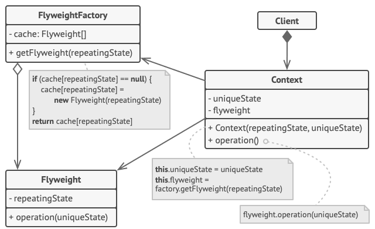

# Flyweight Design Pattern

## Definition

Flyweight is a structural design pattern that lets you fit more objects into the 
available amount of RAM by sharing common parts of state between multiple objects 
instead of keeping all the data in each object.



## Example
### Planting a Forest

This is a desktop application with GUI representing 500k trees to be planted 
in the limited space of Swing frame. The flyweight pattern makes this program to take 
less memory. This happens due to the fact that we reuse TreeType link via reference 
to every single instance of a Tree.

```text
500000 trees drawn
---------------------
Memory usage:
Tree size (24 bytes) * 500000
+ TreeTypes size (144 bytes) * 2
---------------------
Total: 7MB (instead of 72MB)
```


## Other

- Example is from awesome website [Refactoring Guru](https://refactoring.guru)


